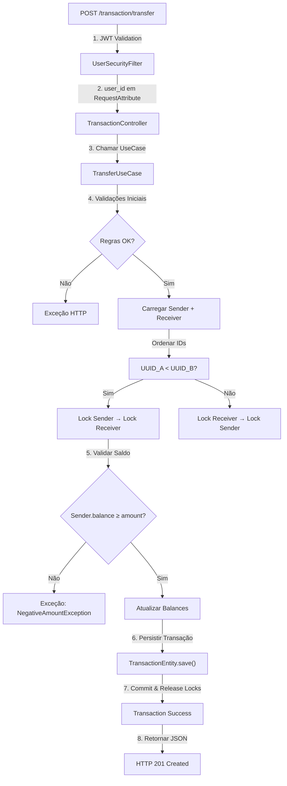

# Payment System 💳

[](https://openjdk.org)
[](https://spring.io)
[](https://maven.apache.org)
[](LICENSE)
[](https://www.sonarsource.com/products/sonarqube/)

Uma **plataforma de carteira digital transacional** implementada com princípios sólidos de engenharia de software. O sistema gerencia operações financeiras de usuários (depósitos, saques, transferências) com foco em **consistência de dados**, **isolamento de escopo**, **segurança** e **escalabilidade**.

Desenvolvida como referência de boas práticas em **arquitetura backend**, **padrões de design** e **qualidade de código** em ecossistemas Java/Spring Boot modernos.

---

## 📚 Visão Geral do Projeto

### Objetivo

Fornecer uma API RESTful robusta para movimentações financeiras entre usuários com:

- ✅ Autenticação segura via JWT
- ✅ Validações rigorosas de domínio
- ✅ Controle de concorrência para operações críticas
- ✅ Isolamento transacional garantido
- ✅ Auditoria completa de operações

### Casos de Uso Principais

```
[Usuário] → Cadastro/Autenticação → JWT Token
   ↓
[Carteira Digital] → Depósito / Saque / Transferência
   ↓
[Extrato] → Histórico Paginado de Transações
```

---

## 🚀 Funcionalidades

### Autenticação & Gerenciamento de Usuários

| Endpoint         | Método   | Descrição                                | Autenticação |
| ---------------- | -------- | ---------------------------------------- | ------------ |
| `/user/`         | `POST`   | Registrar novo usuário com saldo inicial | Pública      |
| `/user/auth`     | `POST`   | Autenticar e obter JWT token             | Pública      |
| `/user/profile`  | `GET`    | Obter perfil e saldo da carteira         | JWT ✔️       |
| `/user/password` | `PATCH`  | Alterar senha do usuário                 | JWT ✔️       |
| `/user/delete`   | `DELETE` | Deletar conta (soft delete)              | JWT ✔️       |

### Operações Financeiras

| Endpoint                 | Método | Descrição                        | Autenticação | Locking       |
| ------------------------ | ------ | -------------------------------- | ------------ | ------------- |
| `/transaction/deposit`   | `POST` | Adicionar saldo à carteira       | JWT ✔️       | Write         |
| `/transaction/withdraw`  | `POST` | Remover saldo da carteira        | JWT ✔️       | Write         |
| `/transaction/transfer`  | `POST` | Transferir entre usuários        | JWT ✔️       | Write (Ambos) |
| `/transaction/statement` | `GET`  | Histórico paginado de transações | JWT ✔️       | Read          |

### Exemplo de Requisição: Transferência

```bash
POST /transaction/transfer
Authorization: Bearer {JWT_TOKEN}
Content-Type: application/json

{
  "receiver_id": "550e8400-e29b-41d4-a716-446655440000",
  "amount": 150.50
}
```

---

## 🏗️ Arquitetura & Decisões de Design

### 1. **Padrão Clean Architecture com Use Cases**

```
modules/
├── user/
│   ├── controllers/          ← Camada HTTP/REST
│   ├── usecases/            ← Lógica de Negócio (Interface com Domínio)
│   ├── services/            ← Orquestração de Serviços
│   ├── repositories/        ← Abstração de Persistência
│   ├── entities/            ← Modelos JPA
│   └── dtos/                ← Contratos de Entrada/Saída
└── transactions/
    └── [estrutura análoga]
```

**Benefícios:**

- Separação clara de responsabilidades
- Fácil testabilidade
- Baixo acoplamento entre camadas

### 2. **Controle de Concorrência (Pessimistic Locking)**

Operações críticas usam `@Lock(PESSIMISTIC_WRITE)` para evitar race conditions:

```java
@Lock(PESSIMISTIC_WRITE)
@Query("SELECT u FROM UserEntity u WHERE u.id = :id")
UserEntity findByIdForUpdate(@Param("id") UUID id);
```

**Estratégia anti-deadlock:** Transferências ordena UUIDs antes de adquirir locks:

```
Se UUID_A < UUID_B → Lock A primeiro, depois B
Isso garante ordem consistente e evita deadlocks circulares
```

### 3. **Isolamento de Módulos (Domain-Driven Design)**

- **Módulo User**: Gerencia identidade, autenticação e saldo
- **Módulo Transactions**: Registra movimentações (sem acesso direto a User repos)
- **Cross-cutting**: Segurança, Exceções Customizadas, Configuração

```
⚠️ Regra: Transaction.module NÃO consulta User.repository diretamente
✅ Acesso: Via UserEntity carregada pelo JPA + Fetch estratégico
```

### 4. **Autenticação Stateless com JWT**

- Token gerado no login com claims `user_id` e `email`
- Validado em **cada requisição** via `UserSecurityFilter`
- Sem sessão no servidor (escalável horizontalmente)

```java
@Component
@RequiredArgsConstructor
public class UserSecurityFilter extends OncePerRequestFilter {
    // Extrai user_id do JWT e injeta em RequestAttribute
    protected void doFilterInternal(...) {
        String token = extractToken(request);
        Claims claims = tokenProvider.validateAndGetClaims(token);
        request.setAttribute("user_id", claims.getSubject());
    }
}
```

### 5. **Tratamento Centralizado de Exceções**

```java
@RestControllerAdvice
public class GlobalExceptionHandler {
    @ExceptionHandler(UserNotFoundException.class)
    public ResponseEntity<ErrorResponse> handleUserNotFound(...) { ... }
    // Regras de negócio → HTTP Status apropriado
}
```

**Mapeamento Domínio → HTTP:**

- `UserNotFoundException` → 404 Not Found
- `NegativeAmountException` → 422 Unprocessable Entity
- `SameAccountTransferException` → 422 Unprocessable Entity

---

## 📊 Modelos de Dados

### UserEntity

```java
@Entity
@Table(name = "user")
public class UserEntity {
    @Id @GeneratedValue(strategy = GenerationType.UUID)
    UUID id;

    String name;
    String email;              // ✔️ Unique
    String password;           // ✔️ BCrypt Hash (strength: 12)
    BigDecimal balance;        // ✔️ Precisão: NUMERIC(15,2)
    boolean active;            // ✔️ Soft Delete
    Instant createdAt;         // ✔️ Auto-generated
}
```

### TransactionEntity

```java
@Entity
@Table(name = "transaction")
public class TransactionEntity {
    @Id @GeneratedValue(strategy = GenerationType.UUID)
    UUID id;

    @Enumerated(EnumType.STRING)
    TransactionType type;      // DEPOSIT | WITHDRAW | TRANSFER

    @ManyToOne UserEntity sender;      // Null para DEPOSIT
    @ManyToOne UserEntity receiver;    // Null para WITHDRAW

    BigDecimal amount;         // > 0
    Instant createdAt;
}
```

---

## 🔐 Segurança

| Componente                | Implementação                                   |
| ------------------------- | ----------------------------------------------- |
| **Autenticação**          | JWT (auth0-java-jwt)                            |
| **Criptografia de Senha** | BCrypt com strength 12                          |
| **CSRF Protection**       | Desabilitado (API Stateless)                    |
| **CORS**                  | Configurável via application.yml                |
| **Validação de Entrada**  | Jakarta Validation + Custom Rules               |
| **Soft Delete**           | Usuários deletados marcados como `active=false` |

**Fluxo de Autenticação:**

```
1. POST /user/auth (email + password)
2. Valida credenciais (BCrypt.matches)
3. Gera JWT token com user_id e email
4. Cliente armazena token
5. Requisições autenticadas: Header Authorization: Bearer {TOKEN}
6. UserSecurityFilter valida em cada request
```

---

## 🛠️ Stack Tecnológico

### Core Framework

- **Java 21** (LTS com recursos modernos como Virtual Threads prep)
- **Spring Boot 3.5.3** (Latest)
- **Spring Data JPA** (Hibernate ORM)
- **Spring Security** (Autenticação/Autorização)

### Persistência

- **PostgreSQL 16+** (Produção)
- **H2 In-Memory** (Testes)
- **Flyway** (Versionamento de Schema)

### Segurança & Validação

- **java-jwt 4.4.0** (JWT)
- **BCrypt** (Hashing de Senhas)
- **Jakarta Bean Validation** (Constraints)

### API & Documentação

- **OpenAPI 3 / Swagger UI** (springdoc-openapi 2.8.8)
- **MapStruct 1.6.3** (DTO Mapping)
- **Lombok** (Reduce Boilerplate)

### Testes

- **JUnit 5** (Test Framework)
- **Mockito** (Mock/Spy)
- **MockMvc** (HTTP Testing)
- **TestContainers 1.21.3** (Integração - PostgreSQL)
- **Spring Security Test** (Auth Testing)

### Qualidade & Build

- **SonarQube** (Análise Estática)
- **JaCoCo** (Code Coverage)
- **Maven 3.8+** (Build Tool)

---

## 📂 Estrutura de Pastas

```
payment-system/
├── src/
│   ├── main/
│   │   ├── java/br/com/kazuhiro/payment_system/
│   │   │   ├── PaymentSystemApplication.java
│   │   │   ├── config/                 ← Beans & Configuração
│   │   │   │   └── SwaggerConfig.java
│   │   │   ├── security/               ← JWT & Autenticação
│   │   │   │   ├── SecurityConfig.java
│   │   │   │   ├── TokenProvider.java
│   │   │   │   └── UserSecurityFilter.java
│   │   │   ├── exceptions/             ← Exceções Customizadas
│   │   │   │   ├── UserNotFoundException.java
│   │   │   │   ├── NegativeAmountException.java
│   │   │   │   └── GlobalExceptionHandler.java
│   │   │   ├── types/                  ← Enums & Tipos
│   │   │   │   └── TransactionType.java
│   │   │   ├── modules/
│   │   │   │   ├── user/
│   │   │   │   │   ├── controllers/    ← @RestController
│   │   │   │   │   ├── usecases/       ← Lógica de Negócio
│   │   │   │   │   ├── services/       ← Orquestração
│   │   │   │   │   ├── repositories/   ← JPA Interface
│   │   │   │   │   ├── entities/       ← @Entity JPA
│   │   │   │   │   └── dtos/           ← DTOs (Serialização)
│   │   │   │   └── transactions/       ← [Estrutura Análoga]
│   │   │   └── providers/              ← Providers de Data/Hora etc
│   │   └── resources/
│   │       ├── application.yml
│   │       ├── db/
│   │       │   └── migration/
│   │       │       ├── V1__init_schema.sql
│   │       │       └── V2__...
│   │       └── log4j2.xml
│   └── test/
│       ├── java/br/com/kazuhiro/payment_system/
│       │   ├── modules/
│       │   │   ├── user/
│       │   │   │   ├── usecases/       ← Use Case Unit Tests
│       │   │   │   ├── services/       ← Service Unit Tests
│       │   │   │   ├── controllers/    ← Controller Integration Tests
│       │   │   │   └── ...
│       │   │   └── transactions/
│       │   ├── exceptions/             ← Handler Tests
│       │   └── TransactionStatementIntegrationTest.java ← E2E
│       └── resources/
│           └── application-test.yml
├── docker-compose.yml                   ← PostgreSQL para dev/test
├── pom.xml                              ← Maven Config
└── README.md                            ← Este arquivo
```

---

## 🚀 Como Executar

### Pré-requisitos

- **Java 21+** (`java -version`)
- **Maven 3.8+** (`mvn -version`)
- **Docker & Docker Compose** (para PostgreSQL local)

### 1️⃣ Setup do Banco de Dados

```bash
# Inicia PostgreSQL em container
docker-compose up -d

# Verifica se está rodando
docker ps | grep postgres
```

### 2️⃣ Build do Projeto

```bash
# Download de dependências + Compile
mvn clean compile

# Executa migrações Flyway
mvn flyway:migrate
```

### 3️⃣ Executar a Aplicação

**Opção A: IDE (IntelliJ IDEA)**

```
Run → Run 'PaymentSystemApplication'
```

**Opção B: Terminal**

```bash
mvn spring-boot:run

# Output esperado:
# Started PaymentSystemApplication in 3.5 seconds
```

### 4️⃣ Acessar Swagger UI

Após iniciar, abra no navegador:

```
http://localhost:8080/swagger-ui.html
```

**Credenciais de Teste:**

```json
POST /user/
{
  "name": "João Silva",
  "email": "joao@example.com",
  "password": "Senha@123",
  "passwordConfirmation": "Senha@123",
  "initialBalance": 1000.00
}

// Resposta:
{
  "id": "550e8400-e29b-41d4-a716-446655440000",
  "email": "joao@example.com"
}
```

---

## 🧪 Testes

### Executar Todos os Testes

```bash
mvn clean test
```

### Testes Específicos

```bash
# Apenas testes de um módulo
mvn test -Dtest=br.com.kazuhiro.payment_system.modules.user.*

# Apenas um teste
mvn test -Dtest=CreateUserUseCaseTest
```

### Relatório de Coverage (JaCoCo)

```bash
mvn clean test jacoco:report

# Abrir em navegador:
# target/site/jacoco/index.html
```

### Tipos de Teste

| Tipo            | Classe                  | Escopo           | Exemplo                               |
| --------------- | ----------------------- | ---------------- | ------------------------------------- |
| **Unit**        | `*Test.java`            | Métodos isolados | `DepositUseCaseTest`                  |
| **Integration** | `*IntegrationTest.java` | Fluxos com BD    | `TransactionStatementIntegrationTest` |
| **Controller**  | `*ControllerTest.java`  | HTTP Contracts   | `TransactionControllerTest`           |

**Exemplo: Unit Test com Mockito**

```java
@ExtendWith(MockitoExtension.class)
class CreateUserUseCaseTest {
    @Mock private UserRepository userRepository;
    @InjectMocks private CreateUserUseCase useCase;

    @Test
    void shouldCreateUserSuccessfully() {
        // Arrange
        CreateUserRequestDTO request = ...;
        when(userRepository.existsByEmail(...)).thenReturn(false);

        // Act
        CreateUserResponseDTO response = useCase.execute(request);

        // Assert
        assertNotNull(response.getId());
        verify(userRepository).save(any());
    }
}
```

---

## 📊 Qualidade de Código

### SonarQube Analysis

```bash
# Executar análise
mvn clean test sonar:sonar \
  -Dsonar.host.url=http://localhost:9000 \
  -Dsonar.login={seu_token}
```

**Métricas Monitoradas:**

- ✅ Code Smells
- ✅ Bugs & Vulnerabilidades
- ✅ Code Coverage (Mínimo 80%)
- ✅ Duplicação de Código
- ✅ Maintainability Index

### Code Style

O projeto segue:

- **Java Conventions** (CamelCase para métodos, CONSTANT_CASE para constantes)
- **Google Java Style Guide**
- **Spring Boot Best Practices**

---

## 🔄 Fluxo de Transação Crítica: Transferência



**Garantias ACID:**

- **Atomicity**: Ambos usuários atualizam ou nenhum atualiza
- **Consistency**: Invariantes de negócio mantidas (balance ≥ 0)
- **Isolation**: PESSIMISTIC_WRITE evita race conditions
- **Durability**: PostgreSQL persiste mudanças

---

## 🐳 Docker & Containerização

### Executar com Docker

```bash
# Construir imagem
docker build -t payment-system:latest .

# Rodar container
docker run -p 8080:8080 \
  --env DB_HOST=postgres \
  --env DB_USER=payment \
  payment-system:latest
```

### Docker Compose (Dev Environment)

```bash
# Inicia aplicação + PostgreSQL
docker-compose up

# Parar
docker-compose down
```

---

## 📖 Documentação API

A documentação interativa está em:

```
POST   /user/                    ← Registrar
POST   /user/auth                ← Autenticar
GET    /user/profile             ← Perfil (JWT)
PATCH  /user/password            ← Alterar Senha (JWT)
DELETE /user/delete              ← Deletar (JWT)

POST   /transaction/deposit      ← Depositar (JWT)
POST   /transaction/withdraw     ← Sacar (JWT)
POST   /transaction/transfer     ← Transferir (JWT)
GET    /transaction/statement    ← Extrato (JWT)
```

Schemas OpenAPI com exemplos de requisição/resposta em `/swagger-ui.html`

---

## 🤝 Contribuição

1. Fork o repositório
2. Crie branch feature: `git checkout -b feature/nova-funcionalidade`
3. Commit: `git commit -am 'Adiciona nova funcionalidade'`
4. Push: `git push origin feature/nova-funcionalidade`
5. Abra Pull Request

**Guidelines:**

- Mantenha tests acima de 80% coverage
- Siga o style guide (Google Java Style)
- Adicione testes para novas features
- Atualize documentação se necessário

---

## 📝 Licença

Este projeto está sob licença MIT. Veja [LICENSE](LICENSE) para detalhes.

---

## 📞 Contato & Suporte

- **Issues**: [GitHub Issues](https://github.com/seu-usuario/payment-system/issues)
- **Discussões**: [GitHub Discussions](https://github.com/seu-usuario/payment-system/discussions)

---

**Última Atualização**: Junho 2026 | **Versão**: 0.0.1-SNAPSHOT
